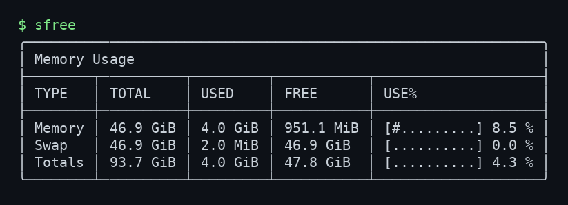

# sfree

[](LICENSE)
[](https://github.com/jlmolinero/superfree/actions/workflows/ci.yml)

`sfree` is a small Linux command-line utility that reads `/proc/meminfo`
and prints memory, swap, and total usage in a colored table.



## Features

- Memory, swap, and combined total usage at a glance.
- Colored usage bars: green for low usage, yellow for medium usage, and red for
  high usage.
- Machine-readable JSON output for scripts and dashboards.
- `free`-compatible flags for units, totals, wide/line output, commit memory,
  repeated sampling, and version/help output.
- Dynamic table layout that detects terminal width and hides low-priority
  columns on narrow terminals to keep rows aligned.
- No runtime dependencies beyond a Linux system with `/proc/meminfo`.
- Simple CMake-based build.

## Requirements

- Linux
- A C++ compiler with C++11 support, such as `g++` or `clang++`
- CMake 3.10 or newer

On Debian/Ubuntu-based systems:

```bash
sudo apt install build-essential cmake
```

On Arch Linux-based systems:

```bash
sudo pacman -S base-devel cmake
```

## Build

```bash
git clone https://github.com/jlmolinero/superfree.git
cd superfree
cmake -S . -B build
cmake --build build
```

## Run

```bash
./build/sfree
```

Output is human-readable by default:

```bash
./build/sfree
```

Choose a specific unit when needed:

```bash
./build/sfree --unit kB
./build/sfree --unit MiB
./build/sfree --unit GiB
```

Supported `--unit` values are `auto`, `B`, `kB`, `KiB`, `MB`, `MiB`, `GB`,
`GiB`, `TB`, `TiB`, `PB`, and `PiB`. The legacy `--human` modifier is still
accepted, but human-readable output is now the default.

Machine-readable JSON:

```bash
./build/sfree --json
./build/sfree --json --unit MiB
```

The JSON payload contains `memory`, `swap`, and combined `total` objects with
numeric values in the selected unit plus usage percentages.

`free`-compatible text output is available with the familiar flags:

```bash
./build/sfree --bytes --total --wide
./build/sfree -h --total
./build/sfree --line --bytes --total --committed
```

Supported `free`-style options include `--bytes`, `--kilo`, `--mega`, `--giga`,
`--tera`, `--peta`, `--kibi`/`-k`, `--mebi`/`-m`, `--gibi`/`-g`, `--tebi`,
`--pebi`, `-h`, `--si`, `--lohi`, `--line`, `--total`, `--committed`,
`--seconds`, `--count`, and `--version`.

Control colors:

```bash
./build/sfree --color auto
./build/sfree --color always
./build/sfree --color never
```

Colors are enabled by default. Use `--color never` only when you want plain
text output without ANSI color escapes.

Memory usage is highlighted by threshold:

- Green: below 60% used.
- Yellow: 60% to 89% used.
- Red: 90% or more used.

The `TYPE`, `TOTAL`, `USED`, and `USE%` cells use the threshold color for each
row.

The default table adapts to terminal width automatically. Wide terminals show
the full `BUF/CACHE`, `AVAILABLE`, and usage-bar columns; narrower terminals
collapse to compact summaries so every table row still fits and stays aligned.

Show help:

```bash
./build/sfree --help
```

## Install

```bash
sudo cmake --install build
```

With the default `/usr/local` install prefix, the install step places the binary
at `/usr/local/bin/sfree` and also creates `/usr/bin/sfree` as a symlink to it,
so the command is available from either standard binary directory. It also
installs the `sfree(1)` man page.

After installation, run it from anywhere:

```bash
sfree
```

Read the manual page:

```bash
man sfree
```

## What the columns mean

| Column | Meaning |
| --- | --- |
| `TOTAL` | Total memory or swap reported by the kernel. |
| `USED` | Used memory. For RAM, this is calculated from `MemTotal - MemAvailable`. |
| `FREE` | Free memory or swap reported by the kernel. |
| `BUF/CACHE` | Kernel buffers plus cached memory. |
| `AVAILABLE` | Estimate of memory available for starting new applications. |
| `USE%` | Usage bar and percentage. |

`BUF/CACHE` and `AVAILABLE` are only meaningful for physical memory; swap and
combined total rows display `-` in those columns.

By default, values are printed using human-readable binary units. Use `--unit`
to force a specific unit.

## Development

Rebuild after changing the source:

```bash
cmake --build build
```

Run a quick smoke test:

```bash
./build/sfree
```

Run the automated CLI test suite:

```bash
ctest --test-dir build --output-on-failure
```

## License

This project is licensed under the GNU General Public License v3.0. See
[`LICENSE`](LICENSE) for details.
